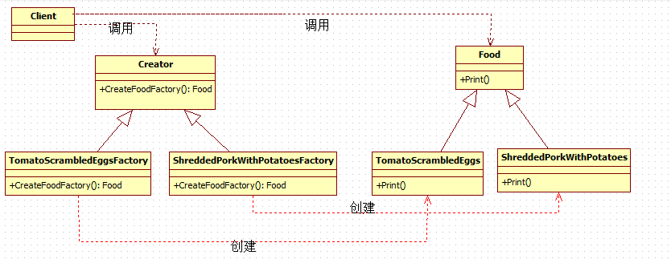
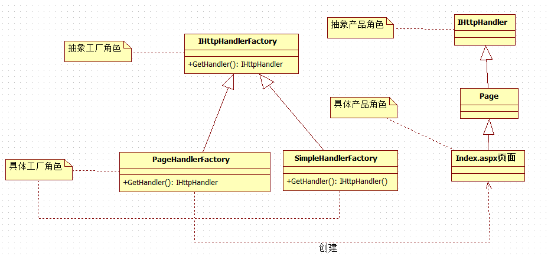

# [工厂方法模式](https://www.cnblogs.com/zhili/p/FactoryMethod.html)

## 一、引言

　　在[简单工厂模式](./简单工厂模式-不属于23种设计模式/SimpleFactory.md)中讲到简单工厂模式的缺点，有一点是——简单工厂模式系统难以扩展，一旦添加新产品就不得不修改简单工厂方法，这样就会造成简单工厂的实现逻辑过于复杂，然而本专题介绍的工厂方法模式可以解决简单工厂模式中存在的这个问题，下面就具体看看工厂模式是如何解决该问题的。

## 二、工厂方法模式的实现

　　工厂方法模式之所以可以解决简单工厂的模式，是因为它的实现把具体产品的创建推迟到子类中，此时工厂类不再负责所有产品的创建，而只是给出具体工厂必须实现的接口，这样工厂方法模式就可以允许系统不修改工厂类逻辑的情况下来添加新产品，这样也就克服了简单工厂模式中缺点。下面看下工厂模式的具体实现代码（这里还是以简单工厂模式中点菜的例子来实现）：

```C#
namespace 设计模式之工厂方法模式
{
    /// <summary>
    /// 菜抽象类
    /// </summary>
    public abstract class Food
    {
        // 输出点了什么菜
        public abstract void Print();
    }

    /// <summary>
    /// 西红柿炒鸡蛋这道菜
    /// </summary>
    public class TomatoScrambledEggs : Food
    {
        public override void Print()
        {
            Console.WriteLine("西红柿炒蛋好了！");
        }
    }

    /// <summary>
    /// 土豆肉丝这道菜
    /// </summary>
    public class ShreddedPorkWithPotatoes : Food
    {
        public override void Print()
        {
            Console.WriteLine("土豆肉丝好了");
        }
    }

    /// <summary>
    /// 抽象工厂类
    /// </summary>
    public abstract class Creator
    {
        // 工厂方法
        public abstract Food CreateFoddFactory();
    }

    /// <summary>
    /// 西红柿炒蛋工厂类
    /// </summary>
    public class TomatoScrambledEggsFactory:Creator
    {
        /// <summary>
        /// 负责创建西红柿炒蛋这道菜
        /// </summary>
        /// <returns></returns>
        public override Food CreateFoddFactory()
        {
            return new TomatoScrambledEggs();
        }
    }

    /// <summary>
    /// 土豆肉丝工厂类
    /// </summary>
    public class ShreddedPorkWithPotatoesFactory:Creator
    {
        /// <summary>
        /// 负责创建土豆肉丝这道菜
        /// </summary>
        /// <returns></returns>
        public override Food CreateFoddFactory()
        {
            return new ShreddedPorkWithPotatoes();
        }
    }

    /// <summary>
    /// 客户端调用
    /// </summary>
    class Client
    {
        static void Main(string[] args)
        {
            // 初始化做菜的两个工厂（）
            Creator shreddedPorkWithPotatoesFactory = new ShreddedPorkWithPotatoesFactory();
            Creator tomatoScrambledEggsFactory = new TomatoScrambledEggsFactory();

            // 开始做西红柿炒蛋
            Food tomatoScrambleEggs = tomatoScrambledEggsFactory.CreateFoddFactory();
            tomatoScrambleEggs.Print();

            //开始做土豆肉丝
            Food shreddedPorkWithPotatoes = shreddedPorkWithPotatoesFactory.CreateFoddFactory();
            shreddedPorkWithPotatoes.Print();

            Console.Read();
        }
    }  
}
```

使用工厂方法实现的系统，如果系统需要添加新产品时，我们可以利用多态性来完成系统的扩展，对于抽象工厂类和具体工厂中的代码都不需要做任何改动。例如，我们我们还想点一个“肉末茄子”，此时我们只需要定义一个**肉末茄子具体工厂类**和**肉末茄子类**就可以。而不用像简单工厂模式中那样去修改工厂类中的实现（具体指添加case语句)。具体代码为：

```c#
 /// <summary>
    /// 肉末茄子这道菜
    /// </summary>
    public class MincedMeatEggplant : Food
    {
        /// <summary>
        /// 重写抽象类中的方法
        /// </summary>
        public override void Print()
        {
            Console.WriteLine("肉末茄子好了");
        }
    }
 /// <summary>
    /// 肉末茄子工厂类，负责创建肉末茄子这道菜
    /// </summary>
    public class MincedMeatEggplantFactory : Creator
    {
        /// <summary>
        /// 负责创建肉末茄子这道菜
        /// </summary>
        /// <returns></returns>
        public override Food CreateFoddFactory()
        {
            return new MincedMeatEggplant();
        }
    }

    /// <summary>
    /// 客户端调用
    /// </summary>
    class Client
    {
        static void Main(string[] args)
        {
           
            // 如果客户又想点肉末茄子了
            // 再另外初始化一个肉末茄子工厂
            Creator minceMeatEggplantFactor = new MincedMeatEggplantFactory();

            // 利用肉末茄子工厂来创建肉末茄子这道菜
            Food minceMeatEggplant = minceMeatEggplantFactor.CreateFoddFactory();
            minceMeatEggplant.Print();

            Console.Read();
        }
    }  
```

## 三、工厂方法模式的UML图

讲解完工厂模式的具体实现之后，让我们看下工厂模式中各类之间的UML图：



从UML图可以看出，**在工厂方法模式中，工厂类与具体产品类具有平行的等级结构，它们之间是一一对应的**。针对UML图的解释如下：

Creator类：充当抽象工厂角色，任何具体工厂都必须继承该抽象类

TomatoScrambledEggsFactory和ShreddedPorkWithPotatoesFactory类：充当具体工厂角色，用来创建具体产品

Food类：充当抽象产品角色，具体产品的抽象类。任何具体产品都应该继承该类

TomatoScrambledEggs和ShreddedPorkWithPotatoes类：充当具体产品角色，实现抽象产品类对定义的抽象方法，由具体工厂类创建，它们之间有一一对应的关系。

## 四、.NET中实现了工厂方法的类

.NET 类库中也有很多实现了工厂方法的类，例如Asp.net中，处理程序对象是具体用来处理请求，当我们请求一个*.aspx的文件时，此时会映射到**System.Web.UI.PageHandlerFactory**类上进行处理，而对*.ashx的请求将映射到**System.Web.UI.SimpleHandlerFactory**类中（这两个类都是继承于IHttpHandlerFactory接口的），关于这点说明我们可以在“C:\Windows\Microsoft.NET\Framework\v4.0.30319\Config\Web.Config”文件中找到相关定义，具体定义如下：

```
 <httpHandlers>
<add path="*.axd" verb="*" type="System.Web.HttpNotFoundHandler" validate="True" />
            <add path="*.aspx" verb="*" type="System.Web.UI.PageHandlerFactory" validate="True" />
            <add path="*.ashx" verb="*" type="System.Web.UI.SimpleHandlerFactory" validate="True" />
</httpHandlers>
```

下面我们就具体看下工厂方法模式在Asp.net中是如何实现的，如果对一个Index.aspx页面发出请求时，将会调用**PageHandlerFactory**中GetHandler方法来创建一个Index.aspx对象，它们之间的类图关系如下：



## 五、总结

工厂方法模式通过面向对象编程中的多态性来将对象的创建延迟到具体工厂中，从而解决了简单工厂模式中存在的问题，也很好地符合了开放封闭原则（即对扩展开发，对修改封闭）。